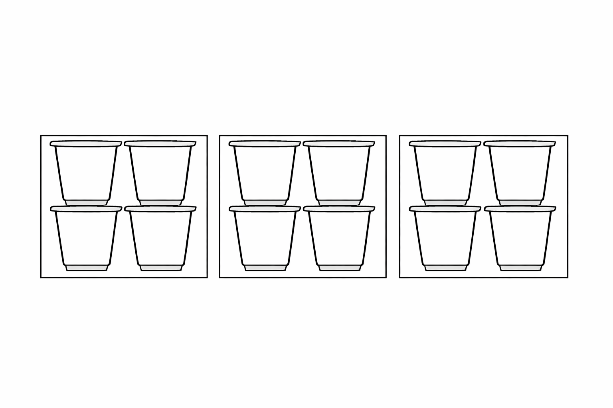

# Talnaskyn, táknskyn, aðgerðaskyn {#skyn}

Orðið skyn á hér að fela í sér bæði skilning og skynjun. 

## Talnaskyn (number sense) {#talnaskyn}

Með talnaskyni er meðal annars átt við að hve miklu leyti við getum reiknað í huganum, tengt saman talnastaðreyndir sem við þekkjum og áttað okkur á stæðarsamanburði talna. Ef við höfum gott talnaskyn, höfum við „tengslahugsun“ um tölur og reikning, og notum okkur staðreyndir um tölur og talnasambönd til að leysa verkefni, og við áttum okkur á samanburði talna (líka brota) út frá eiginleikum (en þurfum ekki endilega að „reikna þær út“, sjáum til dæmis að $\frac{9}{14}$ er örugglega stærri tala en $\frac{1}{2}$, vegna þess að $9>7$).

Í rannsóknum á stærðfræðikennslu byggða á skilningi barna (cognitively guided instruction) kemur í ljós [@kristinsdottir2021]:

> að börn sem fá tækifæri til að leysa þrautir með eigin aðferðum þróa með sér lausnaleiðir sem ákvarðast af fyrri reynslu þeirra og þroskastigi. Þetta ferli er líkt hjá öllum börnum og skiptist í þrjú meginstig:

> Stig 1 — hlutbundið líkan sem fylgir söguþræði

> Stig 2 — talning

> Stig 3 — tengslahugsun og nýting talnastaðreynda

Hlutbundið líkan geta verið hlutir, fingur eða skýringarmyndir. Á stigi 2 er líkanið í huganum -- börnin þurfa ekki lengur að hafa hlutbundna framsetningu á tölu. Það þýðir þó ekki að þau noti ekki til dæmis fingur eða skýringamyndir. Á stigi 3 getum við unnið með tölur á sveigjanlegan hátt og nýtt staðreyndir um tölur og talnasambönd.   

### Dæmi {#daemi-talnaskyn}

* Ef við reiknum $13-9$ með því að hugsa $13 = 10 + 3$ og notum okkur að $10-9=1$ til að sjá að $13-9 = 10 - 9 + 3 = 1 + 3 = 4$.
* Ef við reiknum $4 \cdot 13 = 2 \cdot 2 \cdot 13 = 2 \cdot 26 = 52$

## Táknskyn (symbol sense)  {#taknskyn}

Með táknskyni er meðal annars átt við:

a. Að geta valið hvort gagnlegt sé að nota tákn (eins og bókstafi fyrir breytur og óþekktar tölur) við lausn verkefnis eða ekki
a. Að geta túlkað tákn sem notuð eru til að lýsa reikningum eða aðstæðum
a. Fimi í bókstafareikningi (að umbreyta táknarunum í aðrar jafngildar táknarunur) 
a. Val á réttum táknum fyrir tilteknar aðstæður

Nemendur þurfa að átta sig á því að bókstafir fyrir breytur gegna ólíkum hlutverkum en hafa þó tiltekna eiginleika. Til dæmis: Breytur  

* geta táknað tölur sem vantar (og hægt er að finna út hver er)
* fylgja öllum reiknireglum sem gilda um tölur
* eru stundum tengdar öðrum breytum
* hafa stundum eitt tiltekið gildi, en stundum geta þær haft hvaða gildi sem er

### Verkefni um táknskyn {#verkefni-taknskyn}

Eftirfarandi spurningar reyna á táknskyn með ólíkum hætti. Í hverri línu er fullyrðing sem segja á hvort sé stundum, alltaf eða aldrei sönn. Við höfum áhuga á skilningi svo hér þarf að útskýra *hvers vegna* í sérhverjum lið. Við viljum líka benda á undir hvaða flokk táknskyns hér að ofan hvert dæmi reynir helst á.

**Alltaf, stundum eða aldrei satt:**

* $x+2 < 2x$
* $-x$ er neikvæð tala
* Það skiptir máli hvort við skrifum $4a+10$ eða $4b+10$
* Ef $a$ og $b$ eru breytur, þá er ómögulegt að $a=b$
* $(x+5)^2 = x^2 + 5^2$
* $-(y-1) = -y -1$ 
* $-a^2 = (-a)^2$ 
* Ef þú margfaldar þrjár tölur sem standa saman í talnaröðinni (eins og $13$, $14$ og $15$) verður útkoman alltaf margfeldi af $6$ (með öðrum orðum: $6$ gengur upp í henni).
* Ef $3$ gengur upp í þversummu tölu þá gengur $3$ gengur upp í tölunni.

Táknskyn er ekki eitthvað sem kemur fljótt eða sjálfkrafa. Það þarf að kenna nemendum að vinna með tákn. 

## Aðgerðaskyn (operation sense) {#adgerda-skyn}

Sameiginlegt með talnaskyni og táknskyni er aðgerðaskyn. Þá er átt við að skilja reikniaðgerðir, ólíka eiginleika þeirra og tengsl þeirra á milli, auk þess að hafa vit á því að nota þær við viðeigandi aðstæður og verkefnum.

### Dæmi {#daemi-adgerdaskyn}

Skoðum rununa $5, 8, 11, 14, 17...$ Hvað er í gangi hér?

* Endurtekin samlagning, $5, 5+3, 5+3+3, ...$ sem hægt er að tjá með margföldun
* Táknað með $5 + 3n$ og tengist framsetningu á línu $y = 3x+5$

Við viljum meðal annars að nemendur skilji að endurtekna samlagningu má reikna með margföldun, og átti sig á og geti notað dreifiregluna $a(b+c)=ab+ac$ í sinni talnahugsun og hugarreikningi.

### Verkefni: Víxlregla {#verkefni-vixlregla}

Víxlregla um samlagningu segir að jafnan $a+b = b+a$ sé alltaf sönn. 

1. Gildir víxlregla um frádrátt? Er hægt að segja eitthvað um tölurnar $a$ og $b$ ef $a-b = b-a$? 
1. Er einhver regla á því hvað gerist ef liðum er víxlað í frádrætti? Hvað gerist? 
1. Gildir víxlregla um margföldun? 
1. Gildir víxlregla um deilingu? 

### Verkefni: Börn leysa verkefni um margföldun {#verkefni-myndband-talnaskyn}

Skoðið greinina [„Ég leysi stundum vandamálið með svona hringjum“ - Hugsun barna um margföldun](https://skolathraedir.is/2021/04/21/eg-leysi-stundum-vandamalid-med-svona-hringjum-hugsun-barna-um-margfoldun/). Beinum athygli okkar að talnaskyni barnanna. 

a. Horfið á Óðin leysa verkefnið „Sólveig keypti 4 poka af gulrótum. Í hverjum poka voru 6 gulrætur. Hvað keypti Sólveig margar gulrætur samtals?“ [Youtube-hlekkur](https://youtu.be/rqlU-PLoxOs?si=U6lG57jxB6EKkLsn). Gerið grein fyrir talnaskyni og aðgerðaskyni í lausn Óðins. Til dæmis: Hvaða talnasambönd þekkir hann og hvaða eiginleika margföldunar og samlagningar nýtir hann sér?   

a. Horfið á Torfa leysa sama verkefni.  [Youtube-hlekkur](https://youtu.be/OEZPAQegt9o?si=7VloBBZ5PemM2v_u). Hvaða hæfni nýtir hann sér og hvað bendir til þess að talnaskyn hans sé á þessum punkti þróaðra heldur en hjá Óðni? (Hafið vel í huga að við erum ekki að bera saman nemendurna sjálfa heldur einungis hvað kemur fram í þessum tilteknu lausnum.) 

### Verkefni: Að túlka margföldun og deilingu {#verkefni-tulka-margf-deiling}

Fyllið fyrst inn í eftirfarandi töflu. Það er búið að gera fyrstu röðina. Skýringamyndir eiga að sýna inntak verkefnisins. Útreikningur á að sýna eina margföldun eða deilingu.

| **Dæmi** | **Teiknaðu skýringamynd og segðu hvernig þú reiknar** | **Útreikningur** | **Svar** |
|---|---|---|---|
| **1.** Ég kaupi fjórar samstæður (fernur) af þremur jógúrtdollum. Hve margar dollur af jógúrt kaupi ég alls? | Ég reikna þrjá hópa af fjórum.   | 3 × 4 eða 4 × 3 | **12** |
| **2.** Tveimur pítsum er jafnt skipt á milli fimm manns. Hversu mikið fær hver einstaklingur? |  |  |  |
| **3.** Max sker köku í þrjá jafna hluta. Hann borðar hálfan hluta. Hve stóran hluta (brot) af kökunni borðar hann? |  |  |  |
| **4.** Búðu til þetta dæmi sjálfur! |  | 3 ÷ 1/2 |  |
| **5.** Búðu til þetta dæmi sjálfur! |  | 1/2 ÷ 1/4 |  |

Eftirfarandi er listi af algengum vandræðum. Verkefni ykkar er að útskýra í hverju vandræðin felast, og stinga upp á spurningum eða vísbendingum fyrir nemanda sem lendir í vandanum. 

1. Nemandinn reiknar $5 \div 2$ í spurningu 2. 
1. Nemandinn gefur svarið $1 \frac{1}{2}$ í spurningu 4. 
1. Nemandinn gefur svarið $\frac{1}{8}$ í spurningu 4. 
1. Nemandinn reiknar $\frac{1}{3} \div \frac{1}{2}$ í spurningu 3.
1. Nemandinn skrifar $1 \div 3 \div 2$ í spurningu 3.
1. Nemandinn á erfitt með að gera skýringamynd.
1. Nemandinn klárar verkefnið og þarf útvíkkun og áskorun.

### Verkefni: Jafngild brot {#verkefni-jafngild}

Hvaða heilu tölur má setja inn fyrir bókstafina $x$ og $y$ þannig að brotin verði jafngild?

\[
 \dfrac{x}{30} = \dfrac{2}{y} 
\]

a. Hve mörg jafngild brot er hægt að finna?
a. Breytið tölunum 2 og 30. Hvaða áhrif hefur það á fjölda jafngildra brota sem hægt er að finna? 
a. Finnið tvær tölur sem gefa meira en 20 jafngild brot. 
a. Almenna verkefnið: hvernig getum við sagt, út frá tölunum (sem voru upphaflega 2 og 30) hve mörg jafngild brot við fáum?

### Verkefni: Hraði á hjóli {#verkefni-hradi-hjol}

Þú þarft að hjóla upp hæð, 12 km langan vegarkafla og líka niður hinu megin, sem er líka 12 km langur kafli. Segjum að þú getir hjólað upp hæðina á hraðanum 6 km/klst.

a. Ef þú hjólar niður á hraðanum 20 km/klst, hve lengi ertu að hjóla alla leiðina?
a. Hve hratt þarftu að hjóla niður hinu megin til þess að meðalhraði þinn verði 12 km/klst alla leiðina?
a. Ef þú hjólar upp á hraðanum $x$ km/klst og niður á hraðanum $y$ km/klst, hve lengi ertu þá á leiðinni og hver er meðalhraði þinn?
