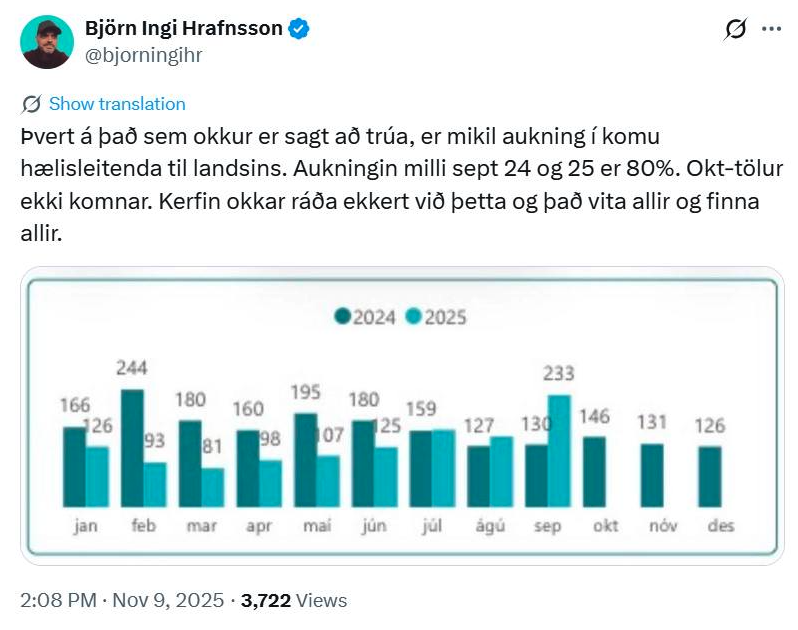
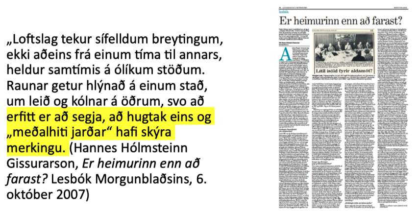

# Gagnrýnin hugsun í stærðfræðimenntun {#gagnryni}

Hvað gæti gagnrýnin nálgun á stærðfræðimenntun falið í sér? Til að hefja leikinn getum við bent á eftirfarandi punkta til skoðunar: 

* Stærðfræðikennsla hefur samfélagslega virkni og áhrif sem blasa ekki endilega við og þarfnast **gagnrýni** 
* Stærðfræði getur verið tæki til að skilja raunveruleikann og þar með tæki til að **gagnrýna** stjórnmál og samfélag
* Stærðfræði getur verið tæki til að móta raunveruleikann og þar með tæki til að stjórna og kúga, og jafnvel drepa fólk, og þessi virkni er oft falin og þarfnast **gagnrýni**

Þá þarf að gera grein fyrir því hvað **gagnrýni** er. Í hversdagslegu íslensku nútímamáli hefur orðið gagnrýni að minnsta kosti tvær merkingar, sem hvor um sig er tengd, en þó ekki jafngild, orðinu sem það átti upphaflega að samsvara úr erlendum málum. Merkingarnar tvær eru að gagnrýni þýði

* neikvæðni og niðurrif, aðfinnslur
* að rýna til gagns -- nánast í hreinni andstöðu við neikvæðni og niðurrif

Hvorutveggja eru merkingar sem eru vissulega tengdar hugtakinu sem orðið gagnrýni átti að ná yfir, en eru þó ólíkar því. Orðið **gagnrýni** var kynnt í íslensku í grein árið 1896, og átti að samsvara orðinu sem er critique á ensku/frönsku, kritik á dönsku/þýsku, og eru ættuð eru úr grísku. Grikkir til forna notuðu orðið kritiké um „listina að dæma“ og í fræðilegri orðræðu merkir það að greina, meta og skilja eitthvað á dýptina, að láta til dæmis ekki blekkjast af yfirborðinu. Hugtakið virðist náskylt íslenska orðinu *dómgreind*. Skýring orðasmiðsins og greinarhöfundarins Valtýs Guðmundssonar, árið 1896 er eftirfarandi:

> Að »krítísera« er eiginlega það, að láta sjer ekki nægja að skoða hlutina eins og þeir líta út á yfirborðinu, heldur leitast við að rýna í gegnum þá og gagnskoða, til þess að sjá hina innri eiginleika þeirra, bæði kosti og lesti. Það er með öðrum orðum að kafa í djúpið og sækja bæði gullið og sorann, greina það hvort frá öðru og breiða hvorttveggja út í dagsbirtunni, svo að allir, sem hafa ekki sjálfir tíma eða tækifæri til að vera að kafa, geti sjeð, hvað er gull og hvað er sori. Þetta virðist oss að mætti kalla á íslenzku gagnrýni og gagnrýninn þann mann, sem sýnt er um að gagnrýna hlutina. (Sjá nánar í [pistli Eiríks Rögnvaldssonar, Að rýna til gagns eða hvað?](https://uni.hi.is/eirikur/2023/09/27/ad-ryna-til-gagns-eda-hvad/)

Í erlenda hugtakinu og fræðilega hugtakinu er sem sagt engin áhersla á gagnsemi heldur snýst gagnrýni um að skilja fyrirbæri, afhjúpa það sem ekki blasir við og taka ígrundaða afstöðu til hlutanna (að nota dómgreindina). Það getur verið gagnlegt og það getur komið út sem niðurrif en það er samt ekki víst að það sé beinlínis gagnlegt og það þarf heldur ekki að fela í sér sérstaka neikvæðni.

Í samhengi stærðfræðimenntunar viljum við nota stærðfræði sem tæki til að skilja og afhjúpa fyrirbæri (samfélagsleg, pólitísk, náttúruleg) og við viljum skilja og afhjúpa það hvernig stærðfræði og stærðfræðimenntun virkar í samfélaginu og hver áhrif stærðfræðinnar eru á heiminn. Gagnrýni spyr hvernig hlutirnir séu í raun en í mörgum fræðahefðum spyr hún líka hvort og hvernig hlutir gætu verið með öðrum hætti, og róttæk gagnrýni krefur okkur líka um afstöðu og aðgerðir til breytinga, jafnvel byltingar. Höfum í huga spakmælið frá Karl Marx: 

> Heimspekingarnir hafa aðeins túlkað heiminn á mismunandi hátt. En það sem máli skiptir er að breyta honum.

## Gagnrýni á stærðfræðikennslu {#gagnryni_kennslu}

Gagnrýnar nálganir á stærðfræðikennslu leiða til dæmis í ljós að stærðfræðikennsla getur valdið persónulegum skaða, getur viðhaldið ójöfnuði með hlutverki sínu sem útilokandi skólafag og hliðvörður inn á ýmsar námsbrautir og starfsferla, og getur með lúmskum hætti stuðlað að ofurvaldi *tæknilegrar rökvísi* (tæknilegrar orðræðu, e. instrumental reason). Tæknileg rökvísi/orðræða gengur út á að orða alla mannlega starfsemi og tilveru sem verkefnið að finna skilvirkustu og hagkvæmustu leiðirnar að einhverjum markmiðum án þess að hægt sé að ræða um réttmæti markmiðanna sjálfra. Stærðfræði gegnir oft veigamiklu hlutverki vegna þess að skilvirkni og hagkvæmni eru oft reiknuð út með einhverjum hætti, og metin á einhvern mælikværða. Gagnrýni getur þá falist í að afhjúpa forsendur, hagsmuni og valdatengsl sem eru byggð inn í skilgreiningar á breytistærðum, formúlum og mælikvörðum. Stærðfræði getur líka veitt skilaboðum vísindalegt, virðulegt eða fræðilegt yfirbragð, og unnið þannig sem hluti af áróðri. 

## Gagnrýni á stærðfræði {#gagnryni_a_stae}

> Stærðfræðingar munu reyna að sannfæra þig um að fræði þeirra séu samfélaginu gagnleg með því að benda á dæmi þar sem þau komu að gagni, en ekki á dæmi þar sem þau voru tímasóun, eða, það sem verra er, á þau fjölmörgu tilvik þar sem hagnýting stærðfræðinnar hefur haft í för með sér mikinn samfélagslegan kostnað, vegna þess hve fjarri raunveruleikanum fágaðar stærðfræðikenningar eru. (Nassim Taleb)

Annað sem er gagnrýnivert er hvernig stærðfræðin sjálf getur valdið skaða: hún er notuð til þess að hanna vopn, hernaðar- og eftirlitstæki og ýmis önnur kúgunartæki. Gervigreind á formi risamállíkana er dæmi um nýlega stærðfræðilega tækni sem hefur haft mikil áhrif á tilveru margra. Ísraelsher notar stærðfræði, meðal annars háþróaða gervigreind, í þágu þjóðarmorðs. Margs konar stærðfræðileg tækni er notuð til að hafa stjórn og eftirlit með fólki. Rafræn skilríki, andlitsskannar, upplýsingasöfnun um netnotkun og símtöl, reiknirit sem velja tiltekin myndbönd fyrir fólk á Youtube og TikTok -- allt byggir þetta á stærðfræði. Stærðfræði er líka notuð til fjármálagjörninga, í hlutabréfaviðskiptum, rafmyntagreftri og utanumhaldi. Þessir hlutir geta haft gífurleg neikvæð áhrif á samfélög, líf fólks og tilveru. Og valdið er hjá þeim sem ákveða hvernig stærðfræðin virkar í hverju tilfelli: með því að ákveða hvað er mælt og talið og hvernig þær stærðir hafa áhrif á útkomuna.  

Við sem vinnum að stærðfræðimenntun viljum þó leggja áherslu á að stærðfræði geti líka nýst til þess að gera gott: hún er notuð á óteljandi sviðum til að bæta líf okkar. Stærðfræði veitir vísindum tungumál, hún gerir fólki mögulegt að tjá náttúrulögmál og regluleika, setja fram magnbundnar kenningar og reikna út spár fyrir framtíðina. Stærðfræði er grundvöllur tölvutækni og reiknilíkana fyrir veður, vexti og vírusa. Eitt af því sem rétt er að taka eftir um þessa hluti er að stærðfræðin í hlutunum er okkur flestum hulin. Það þarf töluverða þekkingu til að skilja hana og til að skilja hana í samhengi við tiltekna hluti og tækni þarf einnig þekkingu á hlutunum sjálfum. Almenningur á því erfitt með að meta hvort stærðfræðin er að „vinna sitt verk“ á réttmætan hátt. Aftur erum við á valdi þeirra sem ákveða hvaða breytur skipta máli og hvernig reiknað er út frá þeim.   

Ég dreg þetta saman svona: stærðfræði má nota bæði til góðs og ills og hún er notuð bæði til góðs og ills. En það getur verið erfitt fyrir utanaðkomandi að átta sig á því hvort er eða leggja mat á það hvort stærðfræðin (eða tæknin) gerir það sem sagt er að hún geri. Það eru pólítísk og siðferðileg álitamál í því hvernig stærðfræði er notuð, sérstaklega þegar hún er notuð til þess að gefa ákvörðunum það yfirbragð að þær séu einfaldlega stærðfræðilega rétt niðurstaða. Því það eru alltaf einhverjar tilteknar forsendur sem byggt er á og þær eru aldrei sjálfsagðar. Um þær gætu verið réttmæt átök. Stærðfræði er því pólitísk.    

## Stærðfræði sem tæki til að gagnrýna með {#stae_taeki_ryni}

Opinber umræða, stjórnmál og áróður fela oft í sér stærðfræðilegar upplýsingar, rök og framsetningar. Það má því segja að pólitísk umræða sé stærðfræðileg. Þá er opinber umræða líka oft um málefni sem hægt væri að öðlast betri skilning á með stærðfræði og sá skilningur ætti að geta gefið forsendur fyrir betur undirbyggðum ákvörðunum. En munum engu að síður að varast tæknilega rökvísi: stærðfræði getur ekki gefið okkur neinar vísbendingar um hvað séu rétt og góð markmið. 

Í stærðfræðimenntun er því reynt að rannsaka möguleika þess að kenna nemendum að meta stærðfræðilegar upplýsingar, rök og framsetningar og að nota stærðfræði til að meta alls konar álitamál. Sem nýlegt dæmi tökum við umræðuna um flóttafólk, fólk sem flýr heimaland sitt þar sem það telur sig ekki geta lifað og leitar verndar í öðru landi. Á Íslandi eins og víðar á Vesturlöndum er ríkjandi orðræða að fjöldi fólk sem sækir um vernd aukist í sífellu. Hér er dæmi um það: 

Hér gæti spurning fyrir nemendur verið: er fullyrðing Björns Inga rétt? Og í framhaldinu: er hún réttmæt, út frá gögnunum sem hann sýnir? Hægt væri að halda áfram og spyrja: hve stórt hlutfall af öllum mannfjölda á landinu er fjöldi fólks sem sækir um alþjóðlega vernd? Þó er ef til vill mikilvægara að spyrja grundvallarspurninga eins og: hvaða máli skipta þessar tölur? Höfum við ekki siðferðislegar skyldu til að taka á móti þeim fjölda af fólki á flótta sem við getum? Af hverju er litið á fólk á flótta sem ógn?  

Önnur eldfim umræða er um loftslagsmál. Hannes Hólmsteinn Gissurarson hefur skrifað margar greinar þar sem hann afneitar loftslagsvísindum. Til dæmis hélt hann því ítrekað fram fyrir tæpum 20 árum (til dæmis árið 2008) að frá 1998 hefði hitafar í heiminum staðið í stað (Sjá Guðna Elísson, 2008) Þetta er endurómur af stefi sem íhaldsmenn héldu ítrekað fram á þessum árum, og hér er eitt dæmi (lauslega þýtt úr ensku): 

> Það er engin hnattræn hlýnun að eiga sér stað núna. Frávik frá meðalhitastigi á árunum 2001-2007 hafa verið 0.4, 0.46, 0.46, 0.43, 0.48, 0.42 og 0.41 gráða. Það að engin hlýnun hefur mælst á 21. öldinni hingað til, á sama tíma og útblástur CO 2 hefur aukist hraðar en nokkurn tíma, er eitthvað sem viðtekin sannindi og tölvulíkönin sem notast er við hafa algerlega mistekist að spá fyrir um (Barwell (2020), vitnað í Lawson, N. (2008). An Appeal to Reason: A Cool Look at Global Warming.))

Það væri mögulegt að tengja þetta brot við framlag Björns Inga hér að ofan og leita að sameiginlegum stærðfræðilegum kjarna í röksemdunum: þau ganga bæði út á að velja „heppilegt“ úrtak úr stærra þýði, það er að segja ódæmigert úrtak. Úrtak Björns Inga er fjöldi í september 2025 og það er borið saman við fjölda í september 2024, væntanlega til þess að gefa í skyn að fjöldi fari sívaxandi. Úrtak Lawson/Hannesar eru hitatölur á árunum 2001-2007, væntanlega til þess að gefa í skyn að hitastig jarðar sé ekki að vaxa. Í hvorutveggja tilfellanna eru til meiri gögn sem sýna að úrtökin eru ekki góðir fulltrúar fyrir þýðið. Í heild er fjöldi fólks sem sækir um vernd mun minni heldur en á sama tíma 2024 og í heild hækkaði hitastig jarðar umtalsvert frá (til dæmis) 1850 auk þess sem að loftslagsvísindi búa yfir kenningum og líkönum sem útskýra bæði hlýnunina og það að hún er ekki algerlega regluleg. Við höfum svo auðvitað upplifað enn meiri og hraðari hlýnun frá 2007 og vitum því að árin 2001-2007 eru ekki dæmigerð.    

Annað dæmi úr loftslagsumræðu þar sem stærðfræðileg þekking getur skipt máli er eftirfarandi fullyrðing Hannesar Hólmsteins Gissurarsonar:

Það mætti þá varpa upp þessari fullyrðingu fyrir eða eftir að nemendur hafa fengist við verkefni sem leiðir í ljós hvernig hugtakið „meðalhiti jarðar“ hefur einmitt mjög skýra merkingu, sem vissulega er stærðfræðileg smíð. Í einfaldaðri lýsingu, fyrir áhugasöm, er það gert svona: 

1. Fyrir hverja veðurstöð í stóru safni veðurstöðva um alla jörð er reiknað meðalhitastig yfir valið tímabil (til dæmis 30 ár). 
2. Fyrir hverja stöð er fundið meðalhitastig hvers tiltekins árs.
3. Þá er reiknaður mismunur meðalhitastigs ársins og langtíma meðalhitastigs (30 ára tímabilsins). Þessi mismunur nefnist hitafrávik (e. anomaly).
4. Hitafrávik jarðar hvert tiltekið ár er meðaltal hitafrávika allra veðurstöðvanna á því ári.  

Eins og gagnrýnir lesendur sjá strax er margt í þessum raunverulegu átakamálum sem stærðfræðin getur ekkert hjálpað með þó að hún geti gefið skýrleika um sumt. Á endanum veltur það á afstöðu okkar til málanna hvort gildi breytistærðanna (tölurnar) og hallatala ferlanna (vaxtarhraði talnanna í tíma) skiptir máli. Lítum við á fólk sem sækir um alþjóðlega vernd sem fólk með mannréttindi eða lítum við á það sem ógn við samfélagið? Viljum við taka áhættuna á því að við í okkar landi komum vel út úr loftslagshamförum meðan önnur þurfi ef til vill að þjást eða farast? Kannski skiptir okkur bara meira máli að halda áfram að auka neyslu okkar? 

## Möguleikar í kennslu {#moguleikar_kennslu}

Renert (2011) lagði fram þrenns konar leiðir í kennslu um/í sjálfbærni: 

* Aðhæfing (accomodation): við nýtum samhengið til að kenna stærðfræði, notum til dæmis loftslagsbreytingar til að kenna um prósentur, meðaltöl, að finna jöfnu línu og svo framvegis. Við gerum lítið til að virkja **gagnrýni**. 
* Umbætur (reformation): reynum að vekja **gagnrýna** hugsun, fáum nemendur til að velta fyrir sér til dæmis gildum, siðferði og fegurð meðfram því að læra um prósentur, meðaltöl, finna jöfnu línu og svo framvegis. En við látum vera að efast um forsendur samfélagsgerðarinnar, neyslusamfélagið, einstaklingshyggju eða notkun stærðfræði. 
* Umbreyting (transformation): fáum nemendur til þess að **gagnrýna** forsendur samfélagsins, reiknilíkana og þeirra eigin menntunar og styðjum nemendur til að fylgja gagnrýninni eftir með aðgerðum. Við látum okkur heiminn varða eins og hann skipti okkur máli. 

Kennaranemar og starfandi kennurar telja oft að þeir geti vel kennt út frá aðhæfingu og jafnvel umbótum, en umbreytingu er erfiðara að sjá fyrir sér. Kannski er ekki vel hægt að stunda svo róttæka kennsluhætti innan opinbers skólakerfis. Kannski þyrftum við að fara að dæmi Greta Thunberg og hætta í skólanum?

## Heimildir {#gagnryni_heimildir}

Barwell, R. (2020). Mathematics and politics? Climate change in the mathematics classroom. Í G. Ineson & H. Povey (Ritstjórar), *Debates in Mathematics Education* (2. útg.) (bls. 197–209).

Eiríkur Rögnvaldsson. (2023). *Að rýna til gagns – eða hvað?*

Guðni Elísson. (2008). Efahyggja og afneitun. *Ritið, 8*(2), 77–114.

Renert, M. (2011). Mathematics For Life: Sustainable Mathematics Education. *For the Learning of Mathematics, 31*(1), 20–26.

