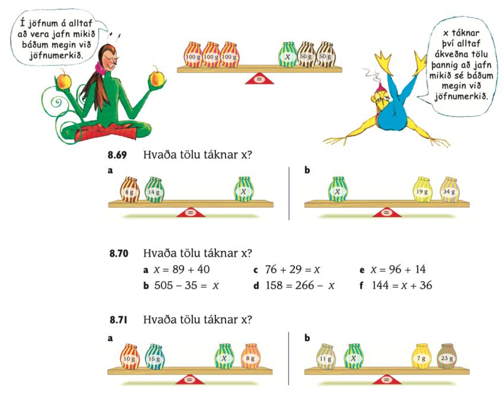
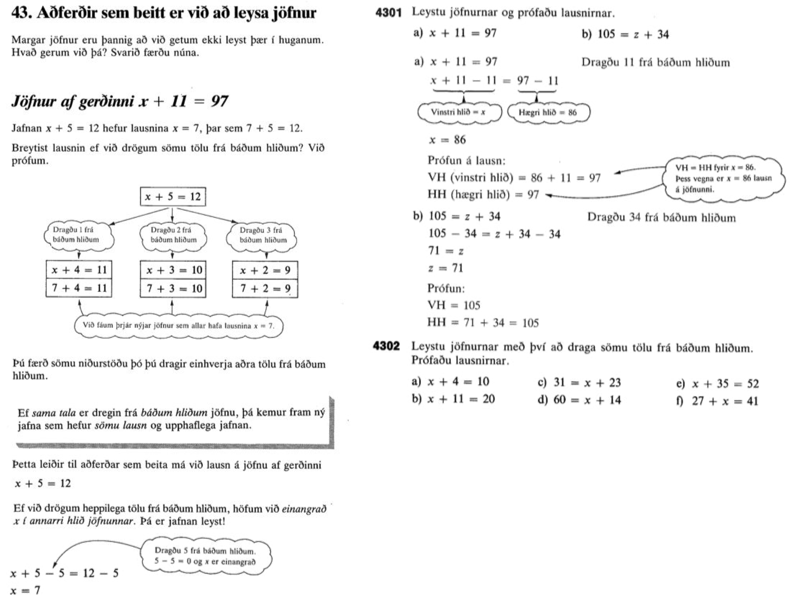
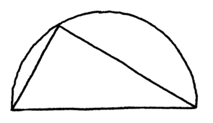

# Sorgarsöngur stærðfræðings {#algebra-samhverfa}

Hér eru nokkrir hlutir til að hugleiða í samhengi við lestur greinar Paul Lockhart, [A Mathematician’s Lament](https://archive.org/details/AMathematiciansLament).

## Algebra og daglegt líf

Á blaðsíðu 8 í *A Mathematician’s Lament* eftir Paul Lockhart stendur að algebra snúist ekki um daglegt líf, heldur tölur og samhverfur. Svo setur hann fyrir spurningu sem hann segir einfalda og fallega:

> Segjum að ég fái gefna summu og mismun tveggja talna. Hvernig finn ég út hverjar tölurnar eru?

### Verkefni: Summa og mismunur {#verkefni-summa-mismunur}

Leysið þetta verkefni. Ef þið hafið leyst það með bókstafareikningi skulið þið næst leysa það með því að skoða verkefnið á talnalínu (gerið ráð fyrir að allar tölur séu jákvæðar). 

<details class="hint">

<summary>Vísbending</summary>

Gerið strik sem táknar summu, til dæmis $A+B$. Merkið svo inn stað fyrir $A-B$. Næst hugsið þið um það hvar þið merkið inn stað fyrir $A$. Það er hægt að segja nákvæmlega hvar á strikinu, út frá því sem búið er að gera, hvar $A$ er.   

</details>

## Samhverfur (breytileiki) {#samhverfur}

Orðið samhverfa (symmetry) er notað í daglegu máli (og í stærðfræði) til að lýsa einhverju sem er eins og spegilmynd um einhverja speglunarlínu eða mynd sem hægt væri að snúa þannig að hún félli aftur ofan í sjálfa sig. Í stærðfræði er til aðeins almennari hugmynd um samhverfu sem Lockhart vísar í með orðinu *symmetry*. Samhverfa er þá almennt **eiginleiki stærðfræðilegs hlutar sem breytist ekki ef einhverri tiltekinni aðgerð er beitt á hann**. Við lítum til dæmis svo á að ef við speglum, færum eða snúum rúmfræðilegum hlut sé hann áfram eins því að rúmfræðilegir eiginleikar hans (fjarlægðir og horn) hafa ekkert breyst. Eitt dæmi úr rúmfræði er að hringur breytist ekki þó að honum sé snúið (eiginleiki punktamengisins að vera hringur með sama geisla breytist ekki). Dæmi úr annarri átt væri að þegar við leggjum saman tölur þá breytist útkoman ekki þó að við breytum röð liðanna, $5+3=3+5$. Samlagning hefur því samhverfu: útkoman breytist ekki við þá aðgerð að víxla liðunum. Við getum líka einfaldlega talað um að eitthvað haldist óbreytt við einhverja aðgerð eða að eitthvað sé *óbreyta* (e. invariant). Það er líka hægt að tala um þetta út frá hugtökunum *breytileika*, *breytileikavídd* og *breytileikamörk*, sjá kafla \@ref(breytileiki). 

### Hvaða aðgerðir breyta ekki lausnum jafna {#samhverfur-jafna}

Finnum samhverfuaðgerðir (eins margar og við getum) í verkefninu um summu og mismun hér að ofan, sem sagt: aðgerðir sem breyta ekki lausnamengi verkefnisins um summu og mismun.

<details class="hint">

<summary>Vísbending 1</summary>

Hvaða aðgerðir þekkið þið sem má framkvæma á jöfnu þannig að hún haldi áfram að hafa sömu lausnir? 

</details>

<summary>Vísbending 2</summary>

Við vitum til dæmis að mengi lausna breytist ekki þó að við bætum (sömu) tölu við báðum megin jafnaðarmerkisins. Við megum líka víxla liðum í summum og við megum líka víxla á hliðum jöfnunnar, þ.e. $A=B$ er jafngilt $B=A$. Það er líka hægt að breyta táknunum, jöfnuhneppið $x+y=S$ og $x-y=M$ er jafngilt jöfnuhneppinu $a+b=c$ og $a-b=d$. En hér er aukaspurning: við vitum: ef $x=y$ þá er líka $x^2=y^2$. Samt er aðgerðin „að hefja báðar hliðar í annað veldi“ ekki samhverfa -- af hverju ekki?     

</details>

## Námskrá {#namskra-lockhart}

Skoðið textann um stærðfræði í https://www.adalnamskra.is/grunnskoli/kafli-25-staerdfraedi-2024.

### Verkefni: Aðalnámskrá út frá Lockhart {#verkefni-namskra-lockhart}

Finnið fullyrðingu í námskránnni um stærðfræði sem Lockhart væri sammála og fullyrðingu sem Lockhart væri ósammála. 

## Kennsluefni um jöfnur {#kennsluefni-jofnur}

Í textanum gefur Lockhart dæmi þar sem nemendum er einfaldlega sagt: „hér er aðferðin, nú notið þið hana“. Dæmi á bls. 5 er eftirfarandi:

> “The area of a triangle is equal to one-half its base times its height.” Students are asked to memorize this formula and then “apply” it over and over in the “exercises.” Gone is the thrill, the joy, even the pain and frustration of the creative act. There is not even a problem anymore. The question has been asked and answered at the same time—there is nothing left for the student to do.

### Verkefni: Samanburður kennsluefnis um jöfnur {#verkefni-kennsluefni-lockhart}

Skoðið eftirfarandi tvö inngangsverkefni um jöfnur og lausnir þeirra úr tveimur ólíkum kennslubókum (A og B). Berið nálganirnar saman. Er önnur þeirra í anda „hér er aðferðin, nú notið þið hana“? Er eitthvað að segja um breytileika (samhverfur) í annarri hvorri eða báðum?

```{r fig-stika-jafna, echo=FALSE, fig.cap="Verkefni A (Stika 3b)", out.width='60%', fig.align='center'}

```

```{r fig-almenn-stae-jofnur, echo=FALSE, fig.cap="Verkefni B (Almenn stærðfræði I)", out.width='80%', fig.align='center'}

```

## Dæmi Regla Þalesar {#lockhart-thales}

Regla Þalesar er undrunarefni (sjá kafla \@ref(undrun)) eins og aðrar reglur í stærðfræði. Í grein Lockharts er fjallað um reglu Þalesar á blaðsíðum 20-22. 

```{r fig-Thales-teikn, echo=FALSE, fig.cap="Þríhyrningur (Regla Þalesar)", out.width='60%', fig.align='center'}

```

Hann gefur okkur mynd af þríhyrningi innan í hálfhring. Það er alls ekki ljóst að hornið sem myndast við punktinn á boganum sé rétt horn. Og ætti hornið ekki að breytast ef punkturinn færist? 

Hana má kynna á mismunandi vegu og hér verða gefnar nokkrar hugmyndir: 

### Regla Þalesar með pappír og blýanti (eða í huganum) {#thales-pappir}

Teiknið eða sjáið fyrir ykkur hálfhring. Hálfhring er hægt að búa til með því að gera fyrst hring og draga svo miðstreng, sem er strik gegnum miðju hringsins með báða endapunkta á hringferlinum. Teiknið svo eða sjáið fyrir ykkur punkt á boganum og strik frá þessum punkti að endapunktum miðstrengsins. Hve stórt er hornið sem myndast milli þessara tveggja strika? 

### Regla Þalesar með kviku rúmfræðiforriti {#thales-geogebra}

Á myndinni er hálfhringur (brotin ferill) og miðþverill hans milli tveggja punkta. Á myndinni er einnig frjáls punktur, C, og mælitala hornsins sem myndast milli strikanna frá endapunktum miðstrengsins og C. 

Spurningin er hvort hægt er að segja eitthvað um stærð hornsins ef C út frá því hvort punkturinn er fyrir utan, fyrir innan eða lendir nákvæmlega á hringboganum.

<iframe scrolling="no" title="Regla Þalesar I" src="https://www.geogebra.org/material/iframe/id/a3r5dxzd/width/600/height/417/border/888888/sfsb/true/smb/false/stb/false/stbh/false/ai/false/asb/false/sri/false/rc/false/ld/false/sdz/false/ctl/false" width="600px" height="417px" style="border:0px;"> </iframe>

Þegar við höfum velt þessu fyrir okkur og prófað og pælt er hægt að kynna reglu Þalesar: Segjum að ABC sé þríhyrningur þar sem AB er miðstrengur hrings. Ef C er á hringferlinum þá er C rétt horn. Og einnig gildir reglan í hina áttina: Ef C er rétt horn liggur C á hringferlinum. En stærðfræðin spyr: Hvers vegna? Hvernig vitum við að það er satt?

Lockhart sýnir sönnun úr kennslubók. Svo er sýnd lausn nemanda í 7. bekk. Setjið ykkur inn í báðar sannanirnar. Berið þær saman. Notar önnur hvor þeirra (eða báðar) samhverfu: eitthvað sem breytist ekki við einhverja aðgerð? Finnst ykkur önnur hvor fallegri, sniðugri, gagnlegri eða meira sannfærandi?

Skoðið umfjöllun um reglu Þalesar í Skala 2b, bls. 29-30. Hvernig kemur hún út í samanburði? 

Að lokum spyrjum við: Hver er tilgangurinn með því að hafa þessa reglu í kennslubókinni, með hliðsjón af markmiðakafla aðalnámskrár, og með hliðsjón af stærðfræði sem „listinni að útskýra“ eða „ævintýri“ (hvoru tveggja nefnt hjá Lockhart) eða stærðfræði sem gagnlegu tæki, mikilvægu fyrir störf og efnahag? 
